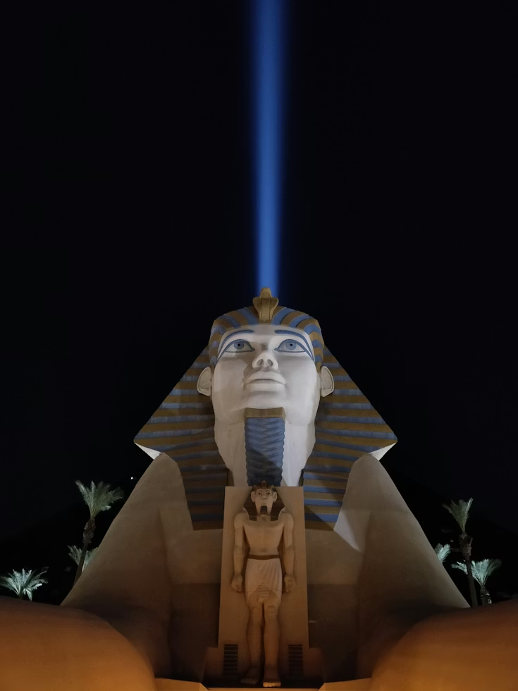

Las Vegas recientemente fue anfitriona de Cloud Next, y ¡guau, qué experiencia! Honestamente, fue bastante intenso. El encanto habitual del paisaje urbano se sentía... un poco mucho. Todas esas luces brillantes y la constante neblina de humo realmente comenzaron a irritarme. Y con los juegos de azar donde quiera que mires, simplemente amplificó la energía frenética ya zumbante de la ciudad. Definitivamente es una sobrecarga sensorial, ¡eso es seguro!

<figure>
  
  <figcaption>Majestad antigua bañada en luz moderna. La colosal estatua de Ramsés II se encuentra poderosamente contra el cielo nocturno, un rayo de luz azul que atraviesa la oscuridad.</figcaption>
</figure>

## La experiencia

Las Vegas posee un cierto encanto caótico, pero durante este evento, la intensidad de la ciudad se sintió abrumadoramente negativa. El gran volumen de personas, el ruido constante y la estimulación implacable crearon una atmósfera claramente desagradable. Fue un contraste discordante con el enfoque de la conferencia en la innovación y la tecnología.